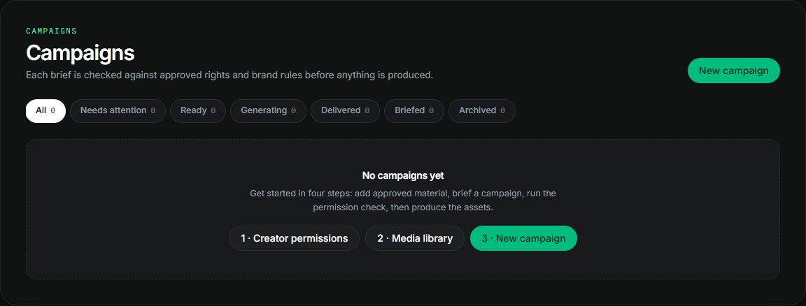
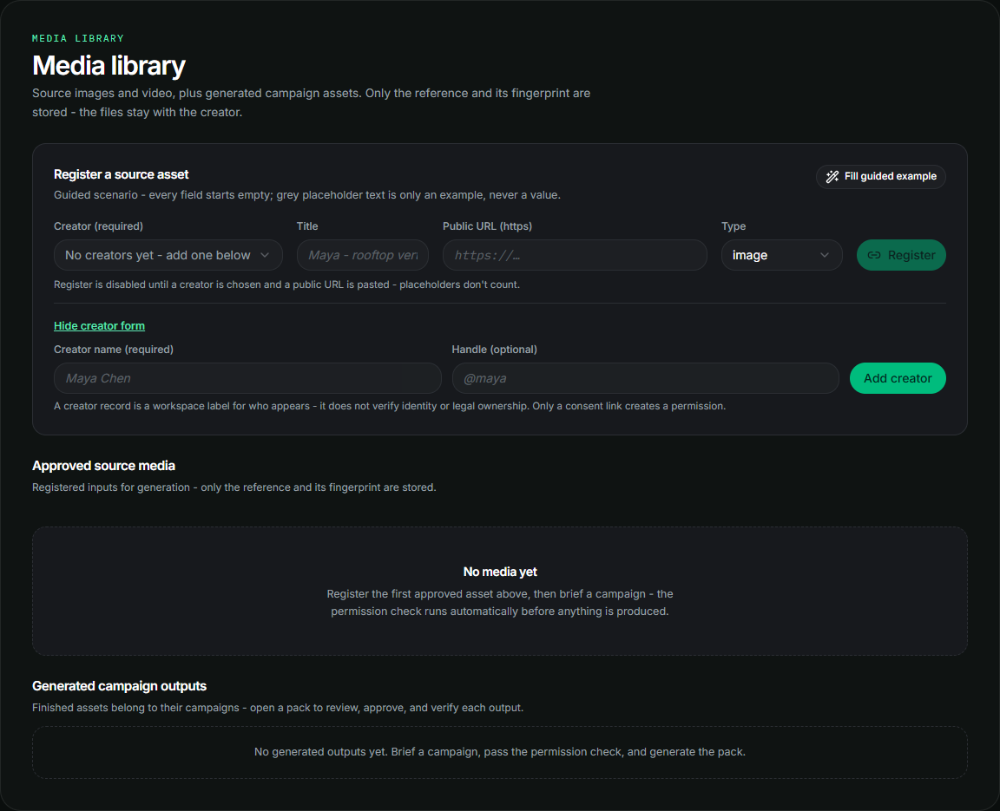
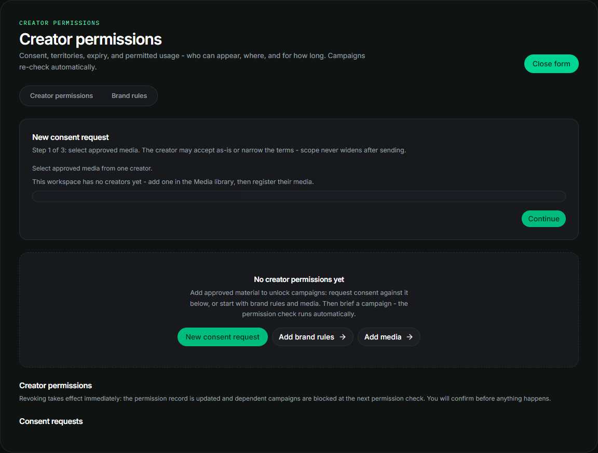
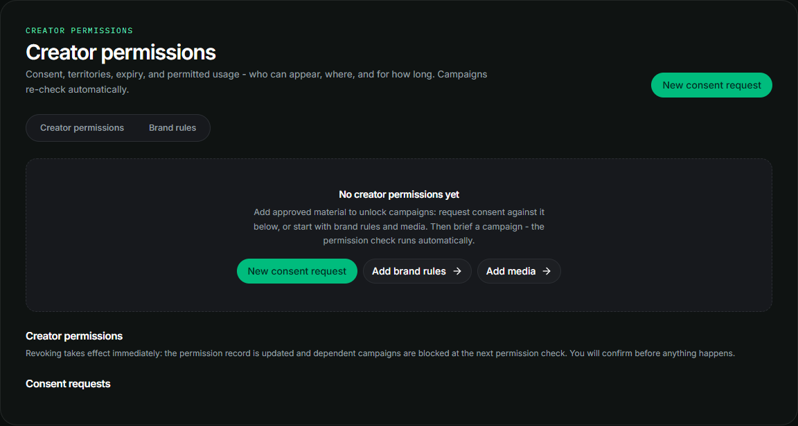

<div align="center">
  <h1>PermitFrame</h1>
  <p><strong>Permission-aware AI campaign production with a reviewable proof trail.</strong></p>
  <p>Turn approved creator rights and brand rules into platform-ready campaign assets, without treating generation as the first step.</p>
  <p><em>Open-source hackathon submission for rights-aware creative production, provider-backed media generation, and verifiable campaign provenance.</em></p>
  <p><a href="docs/getting-started.md">Read the first-run guide</a> · <a href="docs/dkg-and-proof.md">Explore the Track 2 proof story</a> · <a href="docs/campaign-workflow.md">Explore the campaign workflow</a></p>
</div>

<br>

<div align="center">
  
  <p><em>Sanitized first-run state: campaigns remain gated until creator material, consent, and campaign scope are recorded.</em></p>
</div>

## The problem PermitFrame solves

Creative teams often have the same three questions before every campaign:

- May this creator appear in this asset?
- Is this product claim approved?
- Is this territory, platform, and expiry covered?

Those answers are frequently spread across spreadsheets, inboxes, contracts, and memory. The expensive part is not only generating an image. It is discovering a rights mismatch after generation has already spent money, or after the asset has been published.

PermitFrame moves the rights and claim decision before generation. A campaign that is not authorized stays blocked. A campaign that passes the check can move into a reviewed production plan with explicit stages, cost controls, and evidence.

## What PermitFrame is

PermitFrame is a rights-aware creative-production workspace for agencies, producers, and brand teams. It connects four layers:

| Layer | What PermitFrame does |
| --- | --- |
| Permission | Records creator-attested media, platform, territory, expiry, and permitted transformations. |
| Brand rules | Records approved and prohibited product claims with supporting notes. |
| Production | Builds a campaign plan and submits only the selected media stages. |
| Proof | Connects completed outputs to minimized campaign evidence and a point-in-time public record. |

The product is deliberately more than an image generator. Generation is one controlled stage inside a rights, review, and delivery workflow.

## Product principles

- **Permission before spend** - a known rights or claim mismatch blocks the campaign before paid production starts.
- **Human review remains human** - automated checks can flag an issue, but the workspace owner makes the final campaign decision.
- **Private by default** - source media, contracts, contact details, and full prompt text stay out of public proof.
- **Honest provider outcomes** - completed work, failed work, returned capabilities, and returned costs are recorded as they are.
- **Reviewable evidence** - approval and client review are separate states, and public verification appears only after publication genuinely finalizes.

## Core workflow

A complete PermitFrame run follows ten steps:

1. **Add a creator** in Media library.
2. **Register creator-owned media** with a public reference and a descriptive title.
3. **Request consent** for the selected media, platforms, territories, transformations, expiry, and purpose.
4. **Receive creator attestation** through the consent link. The creator may narrow the request, but cannot widen it.
5. **Add brand rules** for the product when the campaign makes claims.
6. **Create a campaign** with the exact permission, media, brand rule, country, and creative brief.
7. **Run the permission check** and fix any linked blockers until the campaign is approved to create.
8. **Choose a production plan** with formats, duration, quality, optional model override, and spend controls.
9. **Generate only after reviewing the plan**, then inspect real outputs, ratio signals, and advisory quality results.
10. **Approve, share, and verify** - the owner gives final approval, client feedback stays advisory, and public proof becomes available when publication finalizes.

For a complete walkthrough, open the [Getting started guide](docs/getting-started.md).

## Product tour

The screenshots below are sanitized empty and onboarding states. They contain no real workspace data, provider output, or production credentials.

| Creator and media setup | Consent request flow |
| --- | --- |
|  |  |
| <em>Create the creator first, then register the media that the consent request will cover.</em> | <em>Request a bounded scope, send the link, and wait for creator attestation.</em> |

| Empty creator permissions | Empty campaigns |
| --- | --- |
|  |  |
| <em>Creator permissions begin with a source-linked consent request.</em> | <em>A new workspace can set up the workflow without paid generation.</em> |

## How the system is divided

PermitFrame itself handles the workflow around generation. Livepeer performs the selected supported media work. The owner performs the final review. Client reviewers provide feedback, not approval.

| Responsibility | Owner |
| --- | --- |
| Authentication and workspace boundaries | PermitFrame |
| Creator, media, consent, and brand records | PermitFrame |
| Permission and claim evaluation | PermitFrame policy engine |
| Image, variation, animation, and other selected media stages | Livepeer production service |
| Cost ceilings, returned costs, and result recording | PermitFrame orchestration layer |
| Asset review and final campaign decision | Workspace owner |
| Client recommendation or change request | Client reviewer, advisory only |
| Public proof publication | PermitFrame after owner approval and successful finalization |

### Livepeer generation

Generation is not mocked. The studio resolves currently available capabilities and submits only the stages selected in the active production plan. The surrounding system records the actual capability that served a job, returned cost, result state, and output reference.

Automatic model selection is recommended. Advanced users can save an image or motion override, but model availability can change. A saved unavailable model must be changed before the plan can be applied.

Every provider result remains honest:

- A successful result points to real output.
- A failed result remains a failure with the available retry path.
- A missing price is shown as unavailable rather than invented.
- A per-run cap is a control, not a promise about every future retry or finishing action.

### Permission and claim checks

The policy layer checks the campaign against the recorded scope before the campaign opens for production. Known mismatches can identify:

- The wrong creator or media.
- A missing or expired permission.
- A platform or territory outside the attested scope.
- A transformation that was not permitted.
- A claim that is missing, prohibited, or unsupported by the selected product facts.

The result is an operational decision, not legal advice. It does not independently verify identity or ownership.

### Proof and delivery

Every eligible output receives a derivative record. Owner approval can create a minimized campaign record and a client share link. Public verification shows only allowlisted, finalized evidence.

The important states are distinct:

- **Campaign record saved** means the approval and campaign record are stored.
- **Public verification ready** means the publication state has genuinely finalized.

A client review link is not a public proof page and does not grant final approval. A public proof page is a point-in-time record of what PermitFrame stored, not a legal certificate.

### Track 2: DKG knowledge and Base Sepolia proof

PermitFrame uses OriginTrail DKG knowledge to make campaign rights decisions and preserve campaign provenance. Before production spend, the policy check evaluates the selected permission, creator, approved source media, permitted claims, platform, territory, transformations, validity window, and revocation state.

The proof lifecycle is explicit:

| State | Meaning |
| --- | --- |
| Local/private | Retained privately, with no public proof link. |
| Shared Working Memory | DKG evidence may be shared, but it is not an on-chain public proof record. |
| Anchored/finalized | The approved campaign record has a canonical UAL and finalized Base Sepolia evidence. |

For a real finalized record, PermitFrame can show the UAL and direct Knowledge Asset and finalization transaction links derived from that record's actual UAL. Base Sepolia is chain ID `84532` testnet. The links are public testnet provenance evidence, not Base mainnet finality, legal ownership verification, or independent legal compliance.

Read [DKG and proof](docs/dkg-and-proof.md) for the complete Track 2 flow, the three proof states, the UAL format, and the limits of the evidence.

## Campaign Film and finishing

PermitFrame supports two different motion paths:

| Short clip | Campaign Film |
| --- | --- |
| One 3 to 15 second motion deliverable. | Several 3 to 15 second scenes assembled into one longer reel. |
| Built from the short-asset production plan. | Built from a separate film plan. |
| Reviewed as part of the normal campaign pack. | An additive motion workflow. |
| Uses a short-pack spend cap when configured. | Requires a separate total film budget cap. |

Narration and burned captions are post-delivery actions:

- **Add narration** requires a reviewer-written script and a separate spend cap. The voice is selected by the production service.
- **Burn captions** is a separate paid finishing action after a film reel is delivered. It is not the same as generating a social caption or claims manifest.
- Narration and burned-caption derivatives remain private and do not automatically enter client share or public verification.
- Music and soundtrack mixing are not available in the current film finishing flow.

Read [Film and finishing](docs/film-and-finishing.md) for the full workflow.

## Privacy and visibility

| Material | Workspace | Client share | Public proof |
| --- | --- | --- | --- |
| Contracts and contact details | Private | Not shown | Not shown |
| Source media file (URL reference) | Remains with its creator or host; PermitFrame records the URL and fingerprint | Not shown by default | Not shown by default |
| Source media file (upload) | Authenticated Cloudinary private workspace copy; workspace image previews stay same-origin | Excluded | Excluded |
| Temporary upload handoff | A server-minted Cloudinary download link expires one hour after creation and is sent only to the production service | Never shown | Never shown |
| Full prompt text | Not public | Not shown | Not shown |
| Completed eligible outputs | Available | Allowlisted outputs only | Approved and finalized outputs only |
| Private narration or burned-caption derivatives | Workspace only | Excluded | Excluded |
| Technical publication evidence | Workspace | Not required | Only after finalization |

An attestation records a creator declaration and its integrity. It does not prove identity, legal ownership, automatic legal compliance, or guaranteed provider output.

## Documentation

The documentation is written for both GitHub readers and a new signed-in PermitFrame user:

- [Guide index](docs/index.md)
- [Getting started](docs/getting-started.md)
- [DKG and proof](docs/dkg-and-proof.md)
- [Campaign workflow](docs/campaign-workflow.md)
- [Film and finishing](docs/film-and-finishing.md)
- [Verification and delivery](docs/verification-and-delivery.md)

The same guide is available in the app under **Docs / Getting started**.

## Technology

- **Application:** Next.js 16 App Router, React 19, TypeScript, Tailwind CSS 4
- **Authentication:** Privy with an HTTP-only PermitFrame session
- **Persistence:** Drizzle ORM with a normalized campaign and evidence model
- **Media production:** Livepeer Agent Creative capabilities
- **Proof layer:** OriginTrail DKG records with explicit publication state
- **Asset delivery:** Durable storage integration for approved deliverables
- **Testing:** Node test runner through `tsx`

## Repository map

```text
src/app/                  App Router pages, API routes, and public docs
src/app/(app)/            Authenticated product workspace
src/app/docs/             Public in-app documentation
src/components/           UI, studio, navigation, and review components
src/server/policy/        Permission and claim policy evaluation
src/server/livepeer/      Production plans, jobs, retries, and receipts
src/server/dkg/           Proof records and publication integration
src/server/db/            Drizzle schema and persistence
public/docs/              Sanitized documentation screenshots
docs/                     GitHub-facing Markdown guides
drizzle/                  Database migrations
scripts/                  Local verification and maintenance scripts
```

## Local development

### Prerequisites

- Node.js 22 recommended
- npm
- A configured PermitFrame environment
- Access to the services required by the workflow you want to test

### Run locally

```bash
npm install
npm run dev
```

Open the local URL printed by Next.js.

Copy `.env.example` to `.env.local` and provide the values required by your local workflow. Never commit `.env.local`, credentials, private keys, bearer tokens, or provider responses.

The public app can be explored without a workspace session. Signed-in workspace features require authentication and the corresponding service configuration.

### Database commands

Run migrations before starting a new local database:

```bash
npm run db:migrate
npm run db:check
npm run db:verify-auth
```

The project uses Drizzle migrations. Do not edit a deployed database manually.

## Quality checks

Run the same checks used for a production review:

```bash
npx tsc --noEmit
npx eslint src/
npm test
npm run build
```

The test suite covers policy decisions, exact rights binding, consent validation, generation recovery, receipts, public-share privacy, verification isolation, and the campaign workflow.

## Deployment overview

`render.yaml` contains the deployment blueprint and expected environment variable names. Secret values belong in the deployment dashboard, not in the repository.

The production path uses the Docker image in `Dockerfile` and the existing Next.js build. Before a release:

1. Configure the authentication, persistence, proof, production, and durable-storage values for the environment.
2. Run database migrations as a controlled release step.
3. Build the application with `npm run build`.
4. Confirm the public liveness probe is healthy.
5. Confirm signed-in integration status separately.
6. Run a safe first-run campaign without paid generation before testing spend.

The exact environment variable names and deployment notes live in `.env.example` and `render.yaml`. Keep operational endpoints, keys, SSH material, and workspace records out of public documentation and screenshots.

## Known limitations

- A shared proof service must be available for shared ledger and public verification workflows. Local UI work can use the local evidence mode where configured.
- Provider capabilities and prices can change. Automatic selection is the safest default.
- A short-pack cap is a per-production-run control, not a guaranteed lifetime total for retries, variations, film scenes, or finishing actions.
- Narration requires a reviewer-written script and a separate cap.
- Music and soundtrack mixing are not available in the current film finishing flow.
- Client share feedback is advisory. Only the authenticated workspace owner gives final campaign approval.
- Public proof is a point-in-time summary of recorded evidence, not identity verification, legal ownership verification, automatic compliance, or a provider guarantee.
- A client share link is capability-based and does not establish the reviewer’s identity.

## Contributing

Keep changes focused and honest:

- Do not weaken permission checks or approval gates to make a demo pass.
- Do not fabricate provider output, costs, publication state, or client decisions.
- Keep public screenshots free of real workspace data and credentials.
- Add tests for policy, privacy, retry, and delivery changes.
- Update the relevant page in `docs/` when user-facing behavior changes.

## License

MIT License. See [LICENSE](LICENSE).

Built for **Track 2 - Livepeer Agent + OriginTrail DKG** of the Atumera Livepeer Agent Hackathon.
