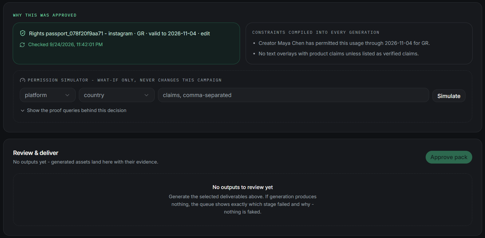
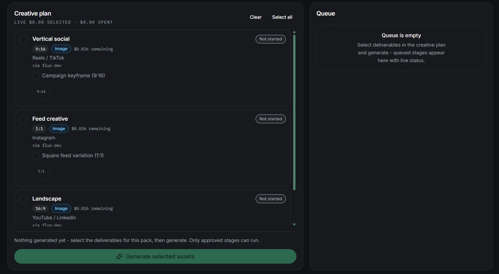
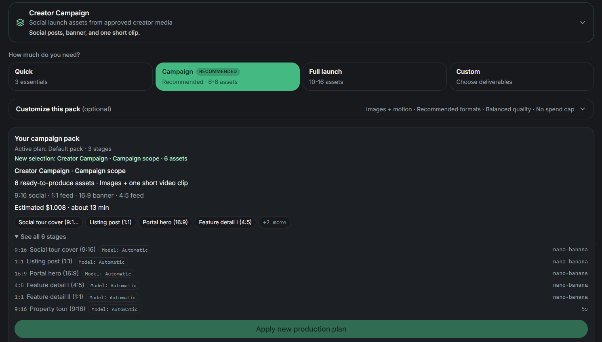
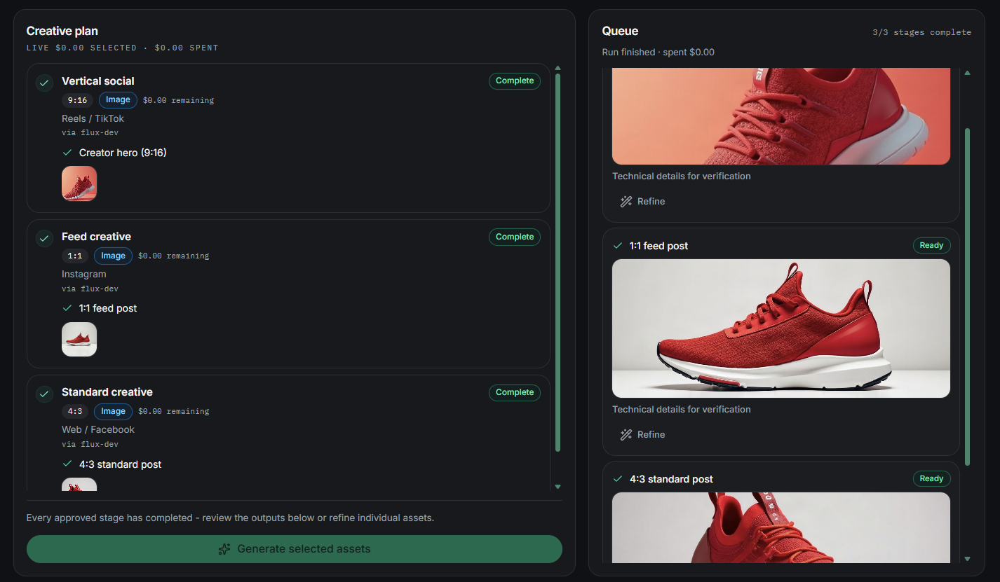
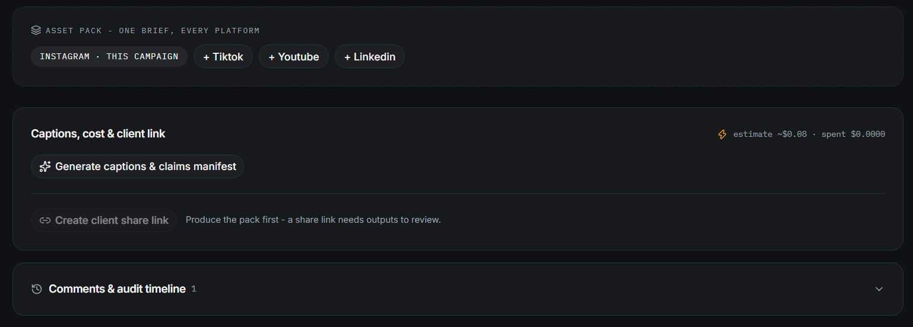
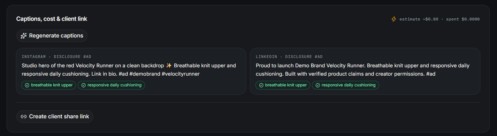
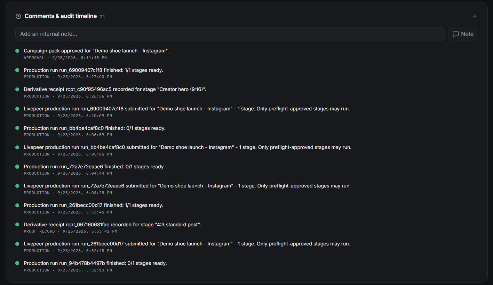

# Campaign workflow

PermitFrame separates campaign authorization from media production. The first question is whether the recorded rights and brand rules allow the work. The second question is what the producer wants to generate.

## 1. Record the source of truth

A campaign can only use inputs that the workspace has recorded:

- A creator label for the person appearing.
- A source-media record owned or controlled by that creator: either a public URL reference or a private workspace upload.
- A creator-attested permission covering the media, platform, territory, expiry, and required transformations.
- A brand rule for the product, with approved and prohibited claims or explicit no-claim guidance.

A creator record is not a permission. A consent request is not active permission until the creator attests it.


## 2. Brief the campaign

The campaign request includes the selected permission, source media, brand rule, country, and creative brief.

The permission check evaluates the selected campaign against recorded scope. Known mismatches can block the campaign before any provider work starts.

A blocked result is an instruction, not a dead end:

1. Open the linked creator-permission or brand-rule fix.
2. Change only the relevant recorded input.
3. Return to the campaign.
4. Run the permission check again.

The campaign opens in **Creative Studio** only after the check allows creation.

## 3. DKG before spend

PermitFrame uses OriginTrail DKG knowledge to make campaign rights decisions and preserve campaign provenance. Before production spend, the check evaluates the selected permission record, creator, approved source media, permitted claims, platform, territory, transformations, validity window, and revocation state.

A creator's consent is a link-based attestation. It records a declaration and its integrity. It does not independently verify identity, legal ownership, or legal compliance.

An approved campaign shows the recorded rights passport, the constraints carried into generation, and a read-only permission simulator. The simulator is for checking a hypothetical platform, territory, or claim; it never changes the campaign.



The proof lifecycle remains explicit:

```text
private/local → Shared Working Memory → anchored Base Sepolia
```

Shared Working Memory evidence is not an on-chain public proof record. A campaign record becomes public proof only after owner approval and a genuinely finalized publication. See [DKG and proof](./dkg-and-proof.md) for the complete Track 2 flow and the exact technical evidence shown for a finalized record.

## 4. Build the production plan

A production plan is the spendable interpretation of the campaign. It lists the stages, formats, duration, quality profile, model choices, and outputs that can be produced.

### The automatic starter plan

When a campaign passes its initial permission check, PermitFrame creates and approves a small **default starter plan** automatically. This is why **Creative plan** can already show deliverables before you have clicked **Apply new production plan**.

The starter plan contains three image stages:

- `9:16` vertical social
- `4:3` standard post
- `1:1` feed creative

It does not include every supported format. In particular, `16:9` landscape is not part of the automatic starter plan, so it will not appear in Creative plan until a plan that includes it is applied.



### Changing the active plan

The recipe, pack-size, and customization controls above Creative plan are a draft. **Apply new production plan** rebuilds that draft, runs it through the recorded permission and brand-rule check, and makes it the campaign's active plan only if the check passes.

For example, the **Real Estate Launch Pack** campaign scope includes a `4:3` feature-detail stage. After you apply that plan, Creative plan shows it under **Standard creative (4:3)**. The Livepeer Creative API accepts that format. Selecting a stage in Creative plan does not change the approved plan; it only chooses which already-approved stage to submit now.

```text
Choose recipe, scope, and formats
        ↓
Apply new production plan (rights check + save)
        ↓
Select active-plan stages in Creative plan
        ↓
Generate selected stages
```

The builder makes the distinction visible: **Active plan** is what may currently run; **New selection** is only a draft until you apply it.



For a **Short clip**, the plan normally includes one 3 to 15 second motion deliverable plus any selected still variations and supporting stages.

Each plan change is validated and reapplied before it becomes active. Review the complete plan rather than only the first stage.

## 5. Choose a model safely

### Automatic

**Automatic (recommended)** lets PermitFrame resolve a capability that is available for the selected quality profile and current provider discovery.

Automatic reduces setup and is the best default when the exact model is not strategically important.

### Optional override

Advanced users can save an image model or motion model for matching stages in a short-clip plan.

A saved override persists when the pack is reopened. Provider availability can change. If a saved model is no longer available, the plan cannot be applied until you choose a current model or return to **Automatic**.

The provider reports the capability that actually served a completed run. Review the result rather than assuming the requested model guarantees a particular output.

### Provider failure recovery

For an eligible provider failure, PermitFrame can create one new provider attempt with a different currently available model for the same stage role and format. This recovery applies only when the model was chosen automatically, the replacement has a known price, and the remaining run budget permits it. The original tracked stage remains the audit record; its prior provider attempt and the backup model are recorded in the queue.

PermitFrame does not silently retry a manually pinned model or retry indefinitely. If it cannot safely select or price a backup, the stage remains failed and offers **Retry same model** or **Retry with backup model**. A manual backup retry starts a new production run and may ask for explicit confirmation when the provider has not returned a usable price estimate.

:::details Supported models and image formats

Still-image and motion models always resolve from live provider discovery at plan time. **Automatic (recommended)** picks an available capability for the plan's quality profile from the known families below; availability can change, so the plan builder refuses a saved choice that is no longer offered.

Still-image families by quality profile:

- Draft: flux-schnell, gemini-image (fast previews, never a final-quality default)
- Balanced: flux-dev, seedream-5-lite, qwen-image-3-t2i, gemini-image
- Premium: flux-pro, gpt-image, ideogram-v4, recraft-v4

Product packshot stages (for example a shoe product photo) prefer pixelcut-product-photo, then flux-pro, then flux-dev. Motion stages (short-clip image-to-video) resolve by profile:

- Draft: ltx-25-i2v-fast, pixverse-i2v, seedance-mini-i2v
- Balanced: kling-v3-turbo-i2v, pixverse-i2v, seedance-mini-i2v
- Premium: kling-v3-turbo-pro-i2v, seedance-i2v, veo-i2v, seedance-mini-i2v

Finishing tools such as upscale resolve separately and never change the approved plan.

Template flows accept the formats `9:16`, `4:3`, `1:1`, and `16:9`. Campaign Film accepts `9:16`, `1:1`, and `16:9`.

For example, the **Real Estate Launch Pack** campaign scope includes a `4:3` feature-detail stage. After you apply that plan, Creative plan shows it under **Standard creative (4:3)**. The Livepeer Creative API accepts that format. Selecting a stage in Creative plan does not change the approved plan; it only chooses which already-approved stage to submit now.
:::

## 6. Understand spend controls

PermitFrame uses two related controls:

- The optional short-pack maximum spend cap checks known estimates for each production run.
- Every supported Livepeer call also carries its own provider cost ceiling.

A displayed estimate uses live pricing when it can be mapped exactly. When it cannot, PermitFrame says that live pricing is unavailable rather than inventing a number.

The short-pack cap is not a guaranteed lifetime total for every future retry, variation, film scene, or finishing action. Review each new paid action separately.

## 7. Generate selected stages

In **Creative plan**, select the deliverables and review the confirmation summary before generation.

Livepeer performs the selected supported media work, which can include image generation, variations, animation, and other discovered production capabilities. PermitFrame performs the surrounding work:

- Build the selected stage graph.
- Submit the exact requested actions.
- Persist provider job and result records.
- Save returned costs and output references.
- Store completed assets for delivery.
- Create derivative receipts.

Only selected active-plan stages are submitted. A stage absent from the active plan - for example `16:9` landscape on the automatic starter plan - cannot be selected until you apply a plan that includes it. Failed provider work is shown honestly and can be retried under the available controls.

:::details Example: completed multi-format creative pack

This example shows three finished shoe-image placements from one reviewed campaign. It illustrates the queue and review surface after real generation; it is not a guarantee that a provider will preserve an unapproved product or identity.


:::

## 8. Review the complete pack

The active plan must be complete before owner approval. A partial run can be inspected, but it is not approval-ready until the remaining required stages are ready or the active plan is changed.

### Ratio

When output dimensions are available, PermitFrame compares the actual ratio with the requested ratio. A known mismatch is marked **Needs ratio review** and excluded from delivery until corrected.

Unknown dimensions remain unknown. PermitFrame does not invent a mismatch.

### Automated review

The visual critique is advisory. It may report no issue, flag an output for attention, or say that the output was not assessed automatically.

An automated pass is not a human approval. A flag is a request for review, not an automatic rejection.

### Human review

The owner checks visual quality, campaign fit, claims, format, and delivery readiness. The owner then uses **Approve pack** when the complete pack is acceptable.

### Captions and client share

After production has created eligible outputs, the workspace can generate captions and a claims manifest, then create a client share link for review. A client share is unavailable before there are outputs to review; it never substitutes for owner approval or public proof.



:::details Example: captions grounded in approved claims

Once eligible outputs exist, PermitFrame can generate platform-specific captions and show the verified claims used in each one. A client share link remains separate from owner approval and public proof.


:::

## 9. DKG evidence after production

After the owner approves the pack, PermitFrame can preserve minimized campaign provenance. The lifecycle is:

```text
private/local → Shared Working Memory → anchored Base Sepolia
```

Shared Working Memory evidence may be available to configured DKG peers, but it is not an on-chain public proof record. A finalized Base Sepolia record can provide a canonical UAL, a Knowledge Asset token link, and a finalization transaction link. Those links appear only when the publisher reports a genuinely finalized anchored record.

:::details Example: campaign audit history

The campaign timeline records production submissions, completed stages, derivative receipts, and approval events. It is a workspace audit trail, not a substitute for independently proving identity, ownership, or provider quality.


:::

The contract address and token ID are derived from the actual UAL. The documentation does not hardcode a contract address. Base Sepolia is a public testnet, not mainnet finality or a legal ownership certificate. See [DKG and proof](./dkg-and-proof.md) for the full explanation.

## What is private and what can be shared

| Material | Default treatment |
| --- | --- |
| Source media file (URL reference) | Remains with the creator or its host. PermitFrame records the URL and a reference fingerprint. The URL is an external, publicly reachable input. |
| Source media file (upload) | Authenticated Cloudinary private workspace copy. PermitFrame records a byte hash and a controlled storage reference. The signed-in workspace can use a same-origin image preview; public consent previews are token-scoped. Storage details and originals are excluded from client shares, public verification, and public proof. |
| Production handoff for an upload | At generation time only, PermitFrame mints a server-side Cloudinary download link that expires one hour after creation and sends it to the production service. It is not persisted in campaign provenance or displayed in the browser. |
| Full prompt text | Not included in public proof. A prompt hash can support integrity evidence. |
| Workspace records | Visible to the signed-in workspace. |
| Client review | Limited to eligible, durably stored outputs and a minimized claim summary. |
| Public verification | Limited to approved, shareable outputs and allowlisted evidence. |
| Narration and burned-caption derivatives | Private finishing outputs. They do not automatically enter client share or public verification. |

## Human and automated responsibilities

| Layer | Automated support | Human responsibility |
| --- | --- | --- |
| Permission | Compare recorded scope, media, expiry, platform, territory, transformations, and claims. | Record accurate inputs and respond to blockers. |
| Production plan | Build stages and attach known cost ceilings. | Choose the right scope, model, and spend control. |
| Generation | Submit selected Livepeer work and record real outcomes. | Confirm spend and retry only when appropriate. |
| Quality review | Report ratio and advisory visual signals. | Inspect every output and decide whether the pack is acceptable. |
| Approval | Enforce readiness gates and record the owner decision. | Give final campaign approval. |
| Client review | Record a recommendation or change request. | Resolve feedback and retain final approval authority. |

## What the proof trail does not mean

The proof trail shows what PermitFrame recorded. It does not establish identity, legal ownership, automatic legal compliance, or a guarantee from the production provider.

Creator attestations prove the declaration and its integrity. The owner approval proves the recorded workspace decision. Neither replaces legal review or a provider service guarantee. For the Track 2 proof lifecycle, see [DKG and proof](./dkg-and-proof.md).
