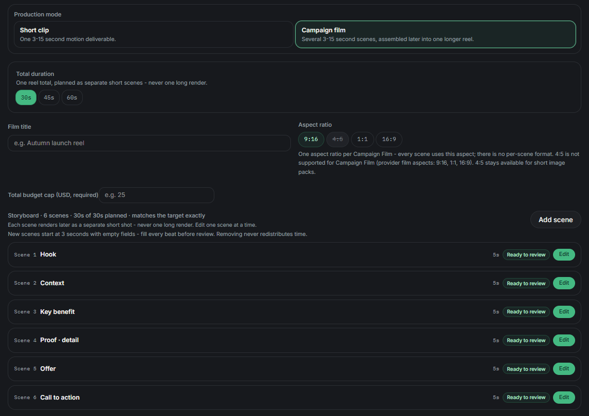

# Film and finishing

PermitFrame has two motion paths. Choose them for different production goals and review them under different spend controls.

## Short clip or Campaign Film?

| Short clip | Campaign Film |
| --- | --- |
| One 3 to 15 second motion deliverable. | Several 3 to 15 second scenes assembled into one longer reel. |
| Built from a short-asset production plan. | Built from a separate film plan. |
| Uses the active campaign pack and its selected stages. | Uses a storyboard, scene durations, one plan-level aspect, and a required total budget cap. |
| Can be reviewed as part of the normal campaign pack. | Is an additive workflow and does not replace the short-pack completion requirements. |

A short clip is the quickest way to produce a focused social deliverable. Campaign Film is for a longer narrative assembled from several scenes.

## Produce a short clip

1. Open an approved campaign in **Creative Studio**.
2. Select **Short clip**.
3. Choose a campaign recipe and pack scope.
4. Customize formats, motion, duration, and quality if needed.
5. Review the model choice and optional maximum spend cap.
6. Apply the production plan.
7. Review the selected stages and estimate.
8. Generate only the deliverables you intend to produce.
9. Wait for the complete active plan.
10. Review ratio and quality signals in **Review & deliver**.

The requested 3 to 15 second range is a PermitFrame product input. Provider validation and actual output still apply.

## Plan a Campaign Film

Campaign Film uses several short scenes that are assembled into a longer reel.

1. Select **Campaign film** in the production planner.
2. Choose a total target of 30, 45, or 60 seconds.
3. Add scenes with individual durations from 3 to 15 seconds.
4. Make the scene total exactly match the selected target.
5. Choose one plan-level aspect ratio: 9:16, 1:1, or 16:9.
6. Enter the required total budget cap.
7. Review the film plan.
8. Save the film plan without generating.
9. Submit the film for generation.
10. Review the final reel when the run reaches a ready state.

`4:3` is deliberately unavailable for Campaign Film because the provider film surface supports only `9:16`, `1:1`, and `16:9`. `4:3` remains available for short image packs.

The scene directions and storyboard are the production brief. The final result depends on the production provider and is not guaranteed to match subjective expectations exactly.

## What Livepeer generates

For a short clip, Livepeer performs the selected supported media-generation and motion stages in the production plan.

For Campaign Film, PermitFrame submits the approved film job and the production service renders the planned scenes and returns a final reel. The reel becomes ready only after a terminal provider result and a usable output.

PermitFrame records real provider outcomes, returned costs, and output references. It does not create a successful-looking result when the provider fails.

## Post-delivery narration

**Add narration** is a separate post-delivery action for a delivered Campaign Film.

Before submitting it:

1. Write the narration script yourself or have a reviewer write it.
2. Confirm the script fits the reel at the selected voice and speed.
3. Set a separate narration spend cap.
4. Review and submit the paid action.

PermitFrame requests text-to-speech, waits for real audio, checks the remaining known budget, and muxes the result only when the provider returns usable audio. The voice is selected by the production service.

The narrated derivative remains private. The original reel is not replaced, and the derivative does not automatically appear in client review or public verification.

## Captions and burned captions are different

### Captions and claims manifest

**Generate captions & claims manifest** creates shareable social copy from policy-allowed claims. It does not modify the video and does not burn text into the picture.

### Burn captions

**Burn captions** is a separate paid finishing action available after a Campaign Film reel is delivered. It requests transcription and caption burning, then creates a new derivative when the result is usable.

A transcript-only result is not described as burned captions. Review the resulting video before treating it as a finished derivative.

Burned-caption derivatives remain private. Review their spend separately from narration and from the original film run.

## Current limitation: no music mixing

Music and soundtrack mixing are not available yet in PermitFrame's film finishing flow.

Do not plan to submit music stems or expect PermitFrame to create a mixed soundtrack. Finish with the delivered visual, optional private narration, and optional private burned captions.

## Review checklist

Before using a film or finishing derivative:

- Confirm the requested duration and aspect.
- Watch the full output.
- Check spoken wording and pacing for narration.
- Check caption placement and legibility for burned captions.
- Confirm the original and derivative are clearly identified.
- Keep private finishing derivatives out of a public claim unless your own review process authorizes it.
- Remember that provider output is not guaranteed.
